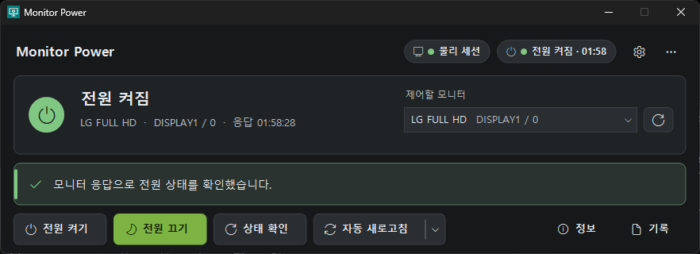

# Monitor Power 2.0

모니터를 선택하고 전원 켜기·끄기와 상태 확인을 간편하게 실행하는 Windows 프로그램입니다.

## 설치

[릴리스](https://github.com/jaehun6912/MonitorPower/releases)에서 둘 중 하나를 받습니다.

- **설치 파일** `MonitorPower-setup-<버전>.exe`: 관리자 권한 없이 사용자 폴더(`%LOCALAPPDATA%\Programs\MonitorPower`)에 설치하고, 시작 메뉴 바로 가기와 제거 항목을 만듭니다. 설치 중에 이미 받아 둔 `ControlMyMonitor.exe`를 고르면 설치 폴더로 복사합니다. 제거할 때 설정 파일을 지울지 묻습니다.
- **휴대용 ZIP** `MonitorPower-<버전>-portable.zip`: 원하는 폴더에 풀고, `ControlMyMonitor.exe`를 `MonitorPower.exe`와 같은 폴더에 넣은 뒤 실행합니다.

ControlMyMonitor는 NirSoft의 프로그램이라 배포본에 포함하지 않습니다. https://www.nirsoft.net/utils/control_my_monitor.html 에서 받으세요.
Windows 10/11과 .NET Framework 4.8(Windows 10 1903 이후와 Windows 11에 기본 포함)이 필요합니다. 별도 런타임 설치 없이 실행합니다.

> **서명되지 않은 실행 파일입니다(설치 파일도 마찬가지).** Windows SmartScreen이나 백신이 실행을 막거나 경고할 수 있습니다.

## 화면



화면 구성은 [RemoteAccessHub](https://github.com/jaehun6912/RemoteAccessHub)와 같습니다. 어두운 바탕에 초록 강조색을 쓰고, 위에서부터 머리글, 상태 카드, 안내 줄, 버튼 줄 순서로 놓입니다. 정보와 기록은 창 아래로 펼쳐집니다.

- **머리글**: 세션 배지(물리 세션 / 원격 세션), 전원 배지(눌러서 지금 확인), ⚙ 설정, ⋯ 더 보기(목록 새로고침, 테마, 도움말, 종료).
- **상태 카드**: 전원 상태를 큰 글씨와 상태 아이콘으로 보여 주고, 모니터 이름·포트·마지막 응답 시각을 함께 표시합니다. 오른쪽에서 제어할 모니터를 고르고, 옆 버튼으로 목록을 새로고침합니다(Ctrl+R). 명령을 처리하는 동안 진행 막대가 나타납니다.
- **안내 줄**: 지금 일어난 일과 다음에 할 일을 알려 줍니다. 진행 중은 파랑, 성공은 초록, 주의는 주황, 실패는 빨강입니다.
- **버튼 줄**: 전원 켜기 · 전원 끄기 · 상태 확인(F5) · 자동 새로고침, 오른쪽에 정보(Ctrl+I) · 기록(Ctrl+L). 전원 켜기를 재시도하는 동안에는 취소(Esc)가 나타납니다.
- **테마**: 시스템 설정 따르기(기본) · 어둡게 · 밝게. ⋯ 메뉴나 설정에서 바꾸며, 제목 표시줄도 함께 바뀝니다.

## 사용하기

- **전원 켜기 / 전원 끄기**: 선택한 모니터에 전원 명령을 보냅니다. 마지막으로 확인한 상태에 따라 다음에 누를 가능성이 높은 버튼이 초록색으로 강조됩니다(켜져 있으면 끄기, 꺼져 있거나 확인할 수 없으면 켜기). 버튼 위치는 바뀌지 않습니다.
- **상태 확인 (F5)**: 모니터가 응답하는 현재 전원 상태를 확인합니다. 머리글의 전원 배지를 눌러도 됩니다.
- **자동 새로고침**: 버튼을 누르면 켜고 끕니다. 오른쪽 화살표로 간격(1초~1분)을 고르고, 다른 값(1~3600초)은 설정에서 정합니다. 버튼을 잠그지 않고 뒤에서 확인하며, 상태가 바뀔 때만 활동 기록에 남깁니다. 확인하는 동안 전원 명령을 누르면 진행 중인 확인이 끝난 뒤 이어서 실행해 두 명령이 겹치지 않습니다. 목록에 있는 모니터만 확인합니다. 알림 영역 아이콘 메뉴에서도 켜고 끌 수 있고, 켜짐 여부와 간격은 저장됩니다. 기본값은 꺼짐입니다.
- **정보 / 기록**: 창 아래에 모니터 정보(이름, 그래픽 어댑터, 장치 이름, 모니터 ID, 짧은 모니터 ID) 또는 활동 기록(명령 대상, D6 값, 응답 코드)을 펼칩니다. 다시 누르면 접힙니다. ‘복사’로 복사하고, 모니터 정보는 항목을 골라 Ctrl+C로도 복사합니다. 기록은 ‘지우기’로 비웁니다. 마지막으로 펼친 쪽을 기억합니다.
- **설정 (⚙, Ctrl+,)**: 테마, 상태 자동 새로고침과 간격, 전원 켜기 최대 시도 횟수(1~30, 기본 10), 닫아도 알림 영역에서 실행.
- **도움말 (F1)**: 단축키, 원격 접속, 연결 문제 해결 방법.
- **알림 영역 아이콘**: 프로그램이 실행 중이면 작업 표시줄 알림 영역에 아이콘이 표시됩니다. 오른쪽 클릭 메뉴에서 창을 열지 않고 켜기·끄기·상태 확인·자동 새로고침을 할 수 있고, 현재 대상 모니터와 상태가 함께 표시됩니다. 창이 숨겨진 상태에서 실행한 결과는 알림으로 알려 줍니다.
- **닫아도 알림 영역에서 실행**: 설정 또는 아이콘 메뉴에서 켭니다. 켜 두면 X 버튼이 프로그램을 끝내지 않고 알림 영역으로 숨깁니다. 완전히 끝내려면 ⋯ 메뉴나 아이콘 메뉴의 ‘종료’를 누르세요. 기본값은 꺼짐입니다.
- **중복 실행 방지**: 이미 실행 중일 때 다시 실행하면 새 창을 열지 않고 실행 중인 창(숨겨져 있어도)을 앞으로 가져옵니다.

전원 켜기는 한 번만 누르면 됩니다. 켜기 신호(D6=1)를 보낸 뒤 0.3초 후 상태를 확인하고, 모니터가 켜짐을 알리지 않으면 다시 보내기를 최대 10번(설정에서 1~30번) 반복합니다. 상태 카드에 몇 번째 신호인지와 진행 막대가 표시되고, 취소(Esc)로 멈출 수 있습니다. 켜짐이 확인되는 즉시 멈추고 몇 번째 신호에 켜졌는지 표시합니다. D6=1은 ‘켜짐으로 설정’하는 값이라 이미 켜진 모니터에 다시 보내도 꺼지지 않습니다. 모두 확인되지 않으면 ‘켜짐 확인 안 됨’(신호가 전달되지 않았다면 ‘명령 전송 실패’)과 함께 전원 버튼 안내를 표시합니다. 시도마다 활동 기록에 남습니다.
끄기는 한 번만 보내고 ‘끄기 요청 완료’와 함께, 꺼진 뒤에는 켜기가 실패할 수 있다는 안내를 표시합니다. 끄기 후에는 연결이 끊길 수 있으므로 별도 상태 조회를 제공합니다. 모니터의 응답을 받은 경우에만 ‘전원 켜짐’ 또는 ‘전원 꺼짐’으로 표시합니다. 명령이 처리되는 동안 조작 버튼은 회색으로 비활성화됩니다.

## 연결 안내

전원을 끈 뒤 DDC/CI 연결이 끊기면 켜기 명령이 Error 31로 실패할 수 있습니다. 이 경우 모니터의 물리 전원 버튼으로 켜 주세요.

사용자의 LG 환경에서는 Chrome 원격 데스크톱에서 전원 제어가 정상 동작했습니다. Windows 원격 데스크톱(RDP) 또는 Remote_Monitor가 감지되면 제어 버튼을 비활성화합니다. Chrome 원격 데스크톱 접속 여부는 자동 판별하지 않습니다.

마지막으로 선택한 모니터와 설정(테마, 자동 새로고침, 켜기 시도 횟수, 펼친 패널, 알림 영역 실행)을 `%APPDATA%\MonitorPower\settings.ini`에 저장합니다. 전원을 끈 뒤 모니터가 목록에서 사라져도, 실행 중은 물론 프로그램을 다시 실행한 뒤에도 그 모니터를 ‘연결 확인 필요’로 표시하고 켜기를 시도할 수 있습니다. 목록에 없는 모니터는 자동 상태 조회를 하지 않습니다. 케이블이나 디스플레이 구성을 바꾼 경우 새로고침 후 대상을 확인해 주세요. 설정 파일을 지우면 초기 상태로 돌아갑니다.

## 개발 정보

C# WinForms / .NET Framework 4.8 / AnyCPU. `src/MonitorPower.csproj`를 Visual Studio에서 열거나, 프로젝트 폴더에서 PowerShell로 빌드합니다. Windows에 들어 있는 .NET Framework 컴파일러를 쓰므로 SDK가 필요 없습니다. 아이콘과 버전 정보가 실행파일에 포함됩니다.

```powershell
.\build.ps1            # portable\ 에 실행 파일
.\build.ps1 -Package   # + artifacts\ 에 휴대용 ZIP과 설치 파일 (Inno Setup 6 필요)
.\tests\run-tests.ps1  # 모의 ControlMyMonitor로 기능·UI 검증
```

Inno Setup 6은 `winget install --id JRSoftware.InnoSetup`으로 설치합니다. 설치 파일 스크립트는 `installer/MonitorPower.iss`입니다. `portable\`에 넣어 둔 ControlMyMonitor 파일은 ZIP과 설치 파일에 들어가지 않습니다.

```
installer/        설치 파일 스크립트 (Inno Setup 6)
tests/            모의 ControlMyMonitor, 기능·UI 검증
src/
  Program.cs      시작, 중복 실행 방지, Windows API
  Theme.cs        RemoteAccessHub 색 팔레트(어둡게·밝게), 글꼴, 아이콘 글리프, 제목 표시줄, 메뉴 색
  Controls.cs     직접 그리는 카드·버튼·상태 배지·안내 줄·상태 아이콘·진행 막대·목록 상자
  MainForm.cs     메인 창 배치와 동작
  Dialogs.cs      설정, 도움말
  MonitorCore.cs  ControlMyMonitor 실행, 목록 해석, 설정 파일
```

화면 구성 요소는 RemoteAccessHub(.NET 8)의 `Theme.cs`, `Controls/*.cs`를 .NET Framework 4.8 기본 컴파일러(C# 5)에 맞게 옮긴 것입니다. 별도 런타임 설치 없이 실행되는 점은 그대로입니다.

`/smonitors` 결과에서 모니터 정보를 읽습니다. 목록 항목은 NirSoft 영문 출력 기준입니다. 언어 파일로 인해 목록이 비면 `ControlMyMonitor_lng.ini`를 다른 위치로 옮겨 주세요.

실제 명령 대상은 선택한 Monitor Device Name이며, 없으면 Monitor ID를 사용합니다. `Primary`로 대체하지 않습니다.

- 조회: `/GetValue <monitor> D6` — 종료 코드 1~5를 알려진 전원값으로 처리합니다.
- 켜기: `/SetValue <monitor> D6 1`
- 끄기: `/SetValue <monitor> D6 4`

이 전원값은 사용자의 LG 모니터 환경 기준입니다. 다른 모델에서는 전원값이 다를 수 있습니다. 전원 명령 자체는 정상 동작이 확인된 이전 버전과 같습니다.

### 검증

모의 도구로 기능 25개와 UI 49개 검증을 통과했습니다. 검증 과정에서 실제 모니터 전원을 변경하지 않았습니다. UI 검증은 `%APPDATA%`가 아닌 임시 폴더의 설정 파일을 사용합니다.

백신(개발 PC의 AhnLab V3)이 검증 중에 새로 컴파일된 모의 도구를 막거나 지우면 첫 목록 조회가 ‘반환 코드 1’로 실패할 수 있습니다. `run-tests.ps1`은 새 실행파일을 한 번씩 미리 실행해 확인이 끝난 뒤 검증을 시작하지만, 그래도 실패하면 다시 실행해 주세요.

## 버전 2.0

- **화면 전면 개편**: RemoteAccessHub와 같은 디자인(어두운·밝은 테마, 머리글 상태 배지, 상태 카드, 안내 줄, 평면 버튼, 아래로 펼치는 정보·기록, 설정 창). 전원 명령과 상태 판정 규칙은 그대로입니다.
- **전원 켜기 재시도**: 켜짐이 확인될 때까지 0.3초마다 상태를 확인하며 다시 보냅니다. 최대 횟수 설정, 취소(Esc).
- **상태 자동 새로고침**: 1~3600초 간격, 상태가 바뀔 때만 기록.
- **설치 파일**: 관리자 권한 없이 설치, ControlMyMonitor 위치 선택, 제거 시 설정 삭제 여부 확인.
- 화면 읽기 프로그램이 전원 상태 변화를 읽어 주고, Windows의 애니메이션 효과 끄기 설정을 따릅니다.

## 버전 1.2

UI와 사용성을 개선했습니다. 전원 명령(D6=1 / D6=4)과 상태 판정 규칙은 1.1과 같습니다.

- 상태에 따른 화면: 켜짐은 초록, 꺼짐·대기·절전은 회청색과 꺼진 화면 아이콘, 주의 상태는 주황으로 표시하고 다음 동작 버튼을 강조합니다.
- 비활성 버튼이 파란 배경에 회색 글씨로 보이던 문제를 고쳐, 사용할 수 없는 버튼은 모두 회색으로 표시합니다.
- 명령 처리 중 진행 표시줄을 표시합니다.
- 항상 떠 있던 주의 안내 상자를 상태 카드 안의 한 줄 안내로 줄이고, 정보 탭을 ‘자세히 보기’로 접어 기본 창 높이를 줄였습니다.
- 알림 영역 아이콘과 빠른 메뉴, 닫아도 알림 영역에서 실행, 중복 실행 방지를 추가했습니다.
- 마지막 모니터를 재시작 후에도 기억하여, 꺼진 뒤 목록에서 사라진 모니터도 켜기를 시도할 수 있습니다.
- 단축키 F5 / Ctrl+R, 정보·기록 복사 버튼, 기록 지우기를 추가했습니다.

## 라이선스

[MIT License](LICENSE). ControlMyMonitor는 NirSoft의 프로그램이며 이 프로젝트에 포함되지 않습니다.
